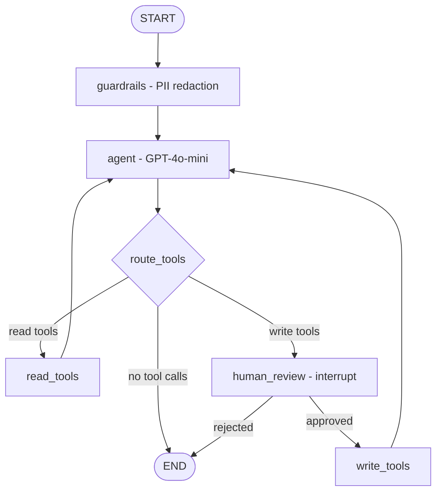

# Wedding Planner — AI Agent

A conversational wedding-planning assistant built with **LangGraph**, **LangChain**, and **LangSmith**. Ask about guest lists, budgets, timelines, and etiquette — the agent queries structured data and a knowledge base to give contextual answers, and requests confirmation before performing any write operations.

---

## Quickstart

### Prerequisites

- Python 3.11+
- An [OpenAI API key](https://platform.openai.com/api-keys)
- A [LangSmith API key](https://smith.langchain.com/) (free tier works)

### Option A — Run locally

```bash
cd agent
cp .env.example .env
```

Open `.env` and paste in your `OPENAI_API_KEY` and `LANGSMITH_API_KEY`.

Then install and run:

```bash
# Create and activate a virtual environment
python -m venv .venv
source .venv/bin/activate        # Windows: .venv\Scripts\activate

# Install the package
pip install -e .

# Start the server
python -m wedding_agent.server
```

Open **http://localhost:8000** in your browser. You'll see a chat interface where you can ask the agent about guest lists, budgets, checklists, and wedding etiquette.

### Option B — Run with Docker

```bash
cd agent
cp .env.example .env
# Edit .env with your API keys
docker compose up --build
```

Open **http://localhost:8000**.

### Run evaluations

With the virtual environment activated:

```bash
cd agent
python -m evals.run_evals
```

Results are pushed to your LangSmith project (requires `LANGSMITH_API_KEY` in `.env`). The eval suite covers tool routing, answer quality, and PII guardrails.

> **Note:** The `agent/` directory contains the full agent application. The root-level React frontend is a separate UI prototype and is **not required** to run the agent.

---

## Architecture

### Graph diagram



### State

| Field | Type | Purpose |
|-------|------|---------|
| `messages` | `list[AnyMessage]` | Full conversation history (LangGraph `add_messages` reducer) |
| `pii_detected` | `bool` | Set by guardrails when PII is found and redacted |

### Nodes

| Node | Role |
|------|------|
| **guardrails** | Regex-based PII scanner. Detects emails, phone numbers, SSNs, and credit-card numbers. Redacts in-place before the message reaches the LLM. |
| **agent** | Calls GPT-4o-mini with tools bound. Decides which tools to invoke (or to respond directly). |
| **read_tools** | Executes read-only lookups — guest list, budget, checklist, and RAG knowledge search. |
| **human_review** | Uses LangGraph `interrupt()` to pause the graph. The server returns a confirmation prompt to the UI; the user approves or rejects. |
| **write_tools** | Executes write operations (RSVP updates, expense recording) only after user approval. |

### Routing logic

After the agent generates a response:

1. **No tool calls** - END (return response to user).
2. **Only read tools** - `read_tools` - back to agent (loop).
3. **Any write tool** - `human_review` (interrupt) - if approved, `write_tools` - agent; if rejected - END with cancellation message.

### Checkpointing

The graph is compiled with `MemorySaver` so:
- Conversations persist across turns within a thread.
- `interrupt()` can pause and resume correctly for human-in-the-loop.

---

## Tools

| Tool | Type | Description |
|------|------|-------------|
| `lookup_guests` | Read | Guest count, RSVP breakdown, dietary restrictions |
| `lookup_budget` | Read | Budget totals and per-category spending |
| `lookup_checklist` | Read | Completed/upcoming planning tasks |
| `search_wedding_knowledge` | Read (RAG) | Semantic search over markdown knowledge base |
| `update_guest_rsvp` | Write | Update a guest's RSVP status |
| `add_budget_expense` | Write | Record a new expense |

All tools support two modes:

- **Live mode** — when `SUPABASE_URL`, `SUPABASE_SERVICE_ROLE_KEY`, and `SUPABASE_WEDDING_ID` are set in `.env`, tools query and write to the real Supabase database (guests, budget_categories, budget_expenses, checklist_items tables).
- **Stub mode** — when Supabase is not configured, tools return realistic hardcoded data so the demo works standalone with only an OpenAI key.

---

## RAG pipeline

The knowledge base lives in `agent/knowledge/` as markdown files:

- **budget_tips.md** — 50/30/20 rule, negotiation tips, off-peak savings
- **etiquette.md** — invitations, plus-ones, seating, gifts, speeches
- **timeline.md** — month-by-month planning checklist

At startup, documents are chunked (500 chars, 50 overlap) with `RecursiveCharacterTextSplitter`, embedded with OpenAI's `text-embedding-3-small`, and stored in an in-memory vector store. The `search_wedding_knowledge` tool runs similarity search (k=3) and returns passages with source attribution.

---

## Guardrails

The `guardrails` node runs before the LLM on every turn. It uses regex patterns to detect and redact:

| PII type | Example | Replacement |
|----------|---------|-------------|
| Email | `sarah@example.com` | `[REDACTED_EMAIL]` |
| SSN | `123-45-6789` | `[REDACTED_SSN]` |
| Credit card | `4111 1111 1111 1111` | `[REDACTED_CARD]` |
| Phone | `(555) 123-4567` | `[REDACTED_PHONE]` |

When PII is detected, the `pii_detected` state flag is set, and the system prompt instructs the LLM to briefly acknowledge the redaction.

---

## LangSmith tracing

All graph runs are traced to LangSmith with:
- `run_name: "wedding_planner_chat"` for API calls
- `run_name: "eval_run"` for evaluations
- Tags: `["wedding-planner", "api"]` or `["eval"]`
- Thread ID in metadata for cross-turn correlation

Set `LANGSMITH_TRACING=true` and `LANGSMITH_API_KEY` in `.env` to enable.

---

## Evaluations

The eval suite (`agent/evals/`) contains 10 test cases covering:

| Category | # Tests | What's checked |
|----------|---------|----------------|
| Tool routing | 7 | Agent calls the correct tool for data vs. advice questions |
| Answer quality | 10 | Response contains expected facts/keywords |
| PII guardrails | 1 | Email in input is redacted; agent acknowledges it |

Evaluators:
- **correct_tool** — did the agent call the expected tool?
- **answer_contains** — does the answer include the expected substring?
- **pii_handled** — for guardrails tests, was PII properly redacted?

---

## Streaming

The chat UI uses Server-Sent Events (SSE) for real-time token streaming. The server's `/chat` endpoint accepts `stream: true` and returns an SSE stream with three event types:

- `token` — a chunk of the agent's response
- `confirm` — a human-in-the-loop confirmation request
- `done` — stream complete

---

## Design decisions

**Why a wedding planner?** It's a domain with natural read/write separation (checking data vs. updating RSVPs), a clear knowledge base, and enough structure to demonstrate routing without artificial complexity.

**Why separate read/write tool nodes?** Rather than interrupting on every tool call, the graph only pauses for write operations. This keeps the UX fast for lookups while adding a safety gate for mutations — a pattern that maps well to real business apps.

**Why regex for PII, not an LLM?** Regex is deterministic, fast, and has zero cost. For a demo it covers the most common patterns. In production I'd layer in a more sophisticated approach (e.g., Presidio or an LLM-based classifier) for edge cases.

**Why MemorySaver, not a database?** For a demo, in-memory checkpointing keeps setup simple. The interface is identical to `SqliteSaver` or `PostgresSaver`, so swapping is a one-line change.

**Why dual-mode tools (live + stubs)?** The tools query Supabase when configured, but fall back to stubs when it's not. This means reviewers can run the demo with just an OpenAI key, while the same code also works against a real database. The service-role key bypasses RLS so the agent doesn't need user-level auth.

---

## What I'd improve with more time

- **Persistent checkpointing** — swap `MemorySaver` for `PostgresSaver` so conversations survive restarts.
- **User-scoped auth** — tie the agent to the logged-in user's session instead of a service-role key.
- **Richer RAG** — add more knowledge docs, use hybrid search (BM25 + semantic), and add a reranker.
- **Multi-turn eval scenarios** — test conversation flows, not just single-turn Q&A.
- **LLM-as-judge evaluator** — assess answer quality and tone beyond substring matching.
- **Presidio-based PII detection** — more robust than regex for edge cases.
- **Authentication** — tie threads to user sessions.
- **Observability dashboard** — surface LangSmith metrics in the UI for the demo.

---

## Project structure

```
agent/
├── knowledge/                  # Markdown knowledge base for RAG
│   ├── budget_tips.md
│   ├── etiquette.md
│   └── timeline.md
├── evals/
│   ├── dataset.json            # 10 eval examples
│   └── run_evals.py            # LangSmith evaluation runner
├── wedding_agent/
│   ├── __init__.py
│   ├── graph.py                # LangGraph definition (5 nodes, checkpointed)
│   ├── guardrails.py           # PII detection and redaction
│   ├── rag.py                  # RAG pipeline (embed + search)
│   ├── server.py               # FastAPI server (REST + SSE streaming)
│   ├── state.py                # Agent state definition
│   ├── tools.py                # Read + write tool stubs
│   └── static/
│       └── index.html          # Chat UI with streaming + confirmation
├── .env.example
├── pyproject.toml
├── Dockerfile
└── docker-compose.yml
```
